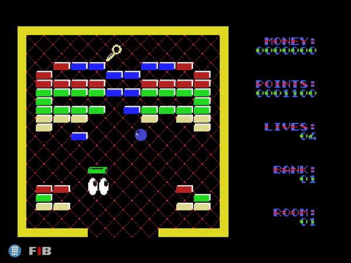

# Break In

This project is a remake of the original Break In (1987) videogame, implemented in C++ via a custome engine. It was developed during the Videogames subject of the Bachelor's Degree in Computer Science of the [Universitat Politècnica de Catalunya](https://www.upc.edu/ca) - [Facultat d'informàtica de Barcelona](https://www.fib.upc.edu/).

*Gameplay!*

## Installation
Just download [Release.zip](https://github.com/MarcMonfort/Break_In/releases) and execute Break_In.exe.

## Built With
* [OpenGL 4.5](https://www.opengl.org/) - Used to renderize graphics.
* [glew 1.13.0](http://glew.sourceforge.net/) - Used to manage OpenGL extensions.
* [freeglut 3.0.0](http://freeglut.sourceforge.net/) - Used to manage windows and OpenGL contexts.
* [FreeType 2.3.5](https://www.freetype.org/) - Used to load images.
* [FMODapi](https://www.fmod.com/) - Used to manage music and sounds.
* [glm 0.9.7.1](https://glm.g-truc.net/) - Used in mathematical operations.

## Authors
- Marc Monfort
- Jordi Cluet
